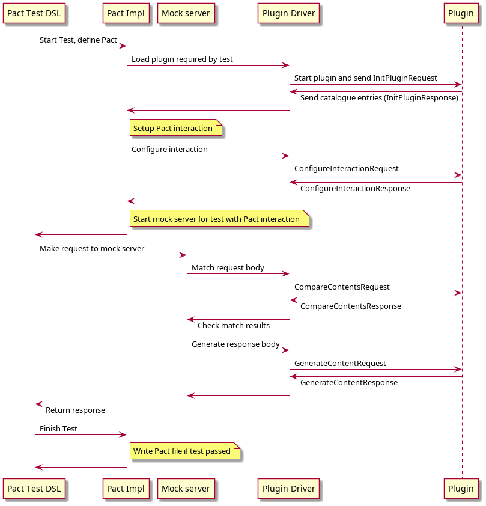
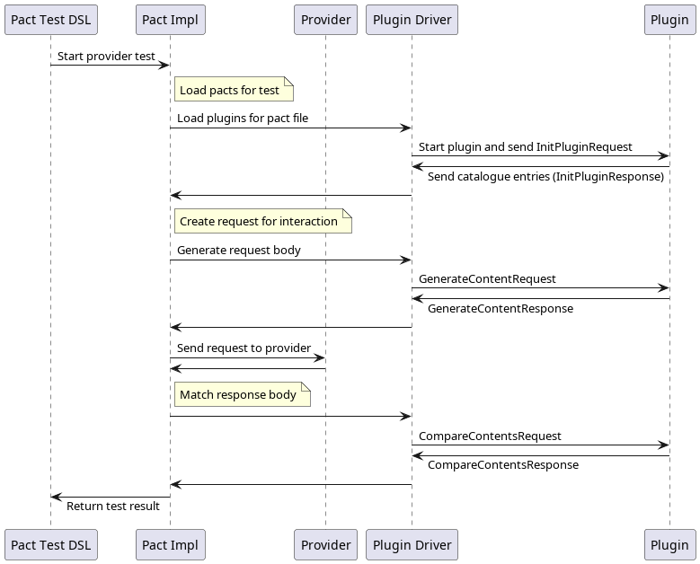

# Content Matchers and Generators

Plugins can provide matchers and generators for different types of content. These contents are the bodies of 
requests and responses and payloads of messages. Matchers are able to compare the contents against the ones from
the Pact interactions, and generators create the contents for use in tests.

If a plugin provides a content matcher, they should also provide a generator.

We will use the [CSV plugin](../plugins/csv) as an example of a plugin that provides a matcher and generator.

## Plugin catalogue entries for content matchers and generators

When a plugin loads, it will receive an `InitPluginRequest` and must respond with an `InitPluginResponse` with the
catalogue entries for the plugin. See the plugin proto file for details of these messages. 

For a content matcher or generator, the entries need to be:

#### Entry Type

The entry type must be set to `CONTENT_MATCHER` or `CONTENT_GENERATOR`.

#### Entry Key

This should be the name of the content type. If there is only one content matcher/generator for the plugin, it can
be the plugin name.

#### Associated values

The values for the entry must contain a `content-types` key that contains all the content types the matcher or
generator supports. If there are multiple content types, they must be separated with a semi-colon (`;`).

For example, for the CSV plugin we return the following two entries:

```rust
proto::InitPluginResponse {
  catalogue: vec![
    proto::CatalogueEntry {
      r#type: EntryType::ContentMatcher as i32,
      key: "csv".to_string(),
      values: hashmap! {
        "content-types".to_string() => "text/csv;application/csv".to_string()
      }
    },
    proto::CatalogueEntry {
      r#type: EntryType::ContentGenerator as i32,
      key: "csv".to_string(),
      values: hashmap! {
        "content-types".to_string() => "text/csv;application/csv".to_string()
      }
    }
  ]
}
```

## Responding to match contents requests

With the `CONTENT_MATCHER` entry with the `content-types` registered, whenever the Pact implementation encounters a content
type from that list, it will direct the matching of the content type to the plugin. 

### Configuring the interaction for a consumer test

In the consumer test, the first thing it will do is send though an `ConfigureInteractionRequest` containing the 
content type and the data the user configured in the test for the interaction. The plugin needs to consume this data,
and then return the data required to configure the interaction (which includes the body, matching rules, generators
and additional data that needs to be persisted to the pact file).

For the CSV plugin, the consumer test looks like:

```java
  @Pact(consumer = "CsvClient")
  V4Pact pact(PactBuilder builder) {
    return builder
      .usingPlugin("csv")
      .expectsToReceive("request for a report", "core/interaction/http")
      .with(Map.of(
        "request.path", "/reports/report001.csv",
        "response.status", "200",
        "response.contents", Map.of(
          "content-type", "text/csv",
          "column:1", "matching(type,'Name')",
          "column:2", "matching(number,100)",
          "column:3", "matching(datetime, 'yyyy-MM-dd','2000-01-01')"
        )
      ))
      .toPact();
  }
```

Here, the request contents `content-type` is set to `text/csv` so Pact knows to send the request to the CSV plugin. 
The remaining keys and values will be sent through to the plugin with the `ConfigureInteractionRequest`.

The plugin will then receive the following request:

```
ConfigureInteractionRequest {
  contentType: "text/csv"
  contentsConfig: {
    "content-type", "text/csv"
    "column:1", "matching(type,'Name')"
    "column:2", "matching(number,100)"
    "column:3", "matching(datetime, 'yyyy-MM-dd','2000-01-01')"
  }
}
```

and the plugin then responds with the body and matching rules required by the test, as well as data plugin specific
data that is needed to persist to the Pact file. For the CSV, the only plugin specific data would be if the CSV includes
headers in the first row or not. For formats like Protobufs, it would need the proto file and compiled descriptors. 

Here is what the CSV plugin responds with:

```
ConfigureInteractionResponse {
    contents: {
      contentType: "text/csv;charset=UTF-8"
      content: "Name,100,2000-01-01\n"
    }
    rules: {
          "column:0": {
            rule [
                {
                  type: "type"
                  values {}
                }
            ]    
          }
        },
        {
          "column:1": {
            rule [
                {
                  type: "number"
                  values {}
                }
            ]
          }
        },
        {
          "column:2": {
            rule [
                {
                  type: "datetime"
                  values {
                    "format": "yyyy-MM-dd"
                  }
                }
            ]
          }      
        }
    }
    generators {
       "column:2" {
            type: "DateTime"
            values {
              "format": "yyyy-MM-dd"
            }
       }
    }
}
```

#### Providing a text markup of the interaction for display in UIs

To aid UIs displaying the interaction details to users, the plugin can provide a marked up text format of the interaction
in the `interactionMarkup` attribute of the `PluginConfiguration`. This will be persisted into the pact file for the
interaction.

### Match content requests

Now that the interaction has been configured, everytime the Pact mock server or verifier encounters a content type
associated with the plugin, the plugin will receive a `CompareContentsRequest` request and must respond with a 
`CompareContentsResponse` with the match results of the contents.

### CompareContentsRequest

The compare contents request has the following attributes:

#### expected
Expected body from the Pact interaction.

#### actual
Actual received body. This will be the body received by the Pact mock server or verifier. 

#### allowUnexpectedKeys
If unexpected keys or attributes should be allowed. If this is set to false, then it is expected that additional keys 
or fields will cause a mismatch. Normally it is set to false when the mock server is matching a request, and set to
true when the verifier is verifying a response.

#### rules
Map of expressions to matching rules. The expressions follow the documented Pact matching rule expressions and should 
match the structure of the contents being matched. For hierarchical data formats (like JSON or XML), the expressions are
based (loosely) on JSON path. For CSV contents, the expressions will match the columns of the CSV data. 

#### pluginConfiguration
Additional data added to the Pact/Interaction by the plugin. This will be the plugin data that was returned in the 
`ConfigureInteractionRequest`.

### CompareContentsResponse

The compare contents response has the following fields:

#### error
Error message if an error occurred. If this field is set, the remaining fields will be ignored and the verification 
marked as failed with the given message. You would use this for reporting things like the contents not being able to be 
parsed because it is not valid.

#### typeMismatch
There was a mismatch with the types of content. If this is set, the results may not need be set. This field should not
really be needed, because the plugins register the contents types they accept. But in the case where the plugin 
receives multiple content types, then this error is for the case where the expected content type is different to the
actual received one.

#### results
Results of the comparison, keyed by matching rule expressions matching the data structure compared. A successful 
comparison is when this attribute is empty, or every key has an empty value. 

## Responding to generate contents requests

Every time the Pact implementation needs to generate contents for a content associated with a plugin, it will send a
`GenerateContentRequest` to the plugin. This will happen in consumer tests when the mock server needs to generate a
response or the contents of a message, or during verification of the provider when the verifier needs to send a 
request to the provider.

### GenerateContentRequest

The `GenerateContentRequest` has the following attributes:

#### contents
Original contents as persisted in the Pact file.

#### generators
Any generators to apply.

### GenerateContentResponse

The generate contents response must contain the updated contents.

#### contents
Contents to return to the consumer or to add to the request sent by the provider.

For example, the CSV test above results in the following request by the mock server:

```
GenerateContentRequest {
    contents: {
      contentType: "text/csv;charset=utf-8",
      content: "Name,100,2000-01-01\n"
    }
    generators: {
        "column:2": {
            type: "DateTime"
            values {
              "format": "yyyy-MM-dd"
            }
        }
    }
}
```

It then parses the CSV, and uses the `DateTime` generator to replace column 2 (0-based), and then returns:

```
GenerateContentResponse {
    contents {
        contentType: "text/csv;charset=utf-8",
        content "Name,100,2021-09-06\n"
    }
}
```

## Sequence Diagrams

### Consumer test


### Provider verification

