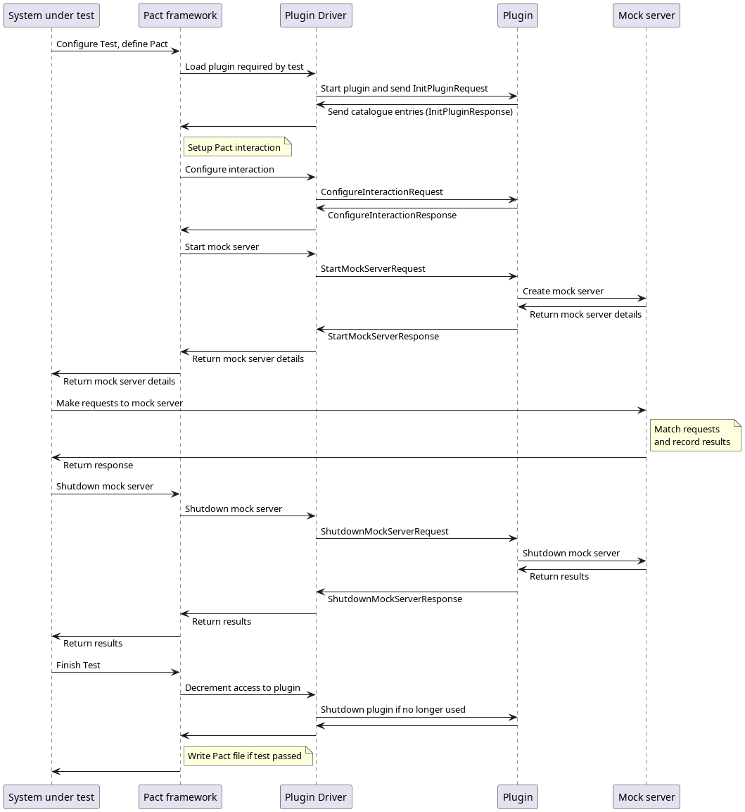
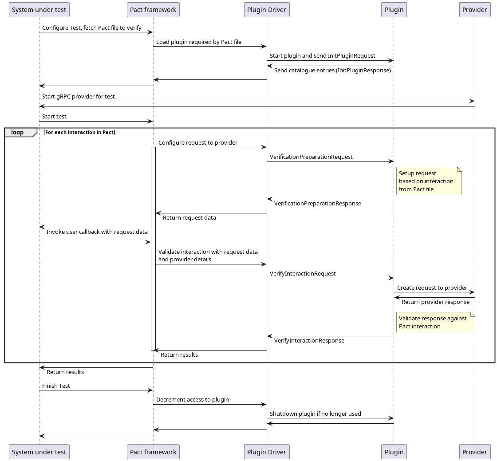

# Protocol Plugin Implementations

One of the features a plugin can provide is a protocol transport implementation. For these, the plugin needs to provide
the following features:

## Required Features

### Mock server
The plugin is required to be able to create a mock server for the protocol, given a Pact file. The mock server is 
required to accept and decode requests or messages, validate what is received against the provided Pact file, and then
return an appropriate response based on what is defined in the Pact file.

### Provider verifier
The plugin is required to be able to verify a provider, given a Pact file. For each interaction in the Pact file, it
needs to be able to construct a request/message using the Pact file, and send it to the provider. Finally, it needs to be 
able to validate the response from the provider using the details in the Pact file.

### Content Matcher and Generator

If the protocol uses a non-standard payload format, a content matcher and generator must also be provided. 
See [Content matcher design docs](content-matcher-design.md).

### Plugin catalogue entries for protocol transports

When a plugin loads, it will receive an `InitPluginRequest` and must respond with an `InitPluginResponse` with the
catalogue entries for the plugin. See the plugin proto file for details of these messages.

For protocol transports, the entries need to include:

##### Entry Type

The entry type must be set to `TRANSPORT`.

##### Entry Key

This should be the name of the protocol.

##### Associated values

Not required.

## Example interaction from a consumer test

_High Level Summary_

1. Plugin driver is responsible for starting the plugin. The Pact framework communicates instructions for each Test Session to the plugin via the plugin driver and the gRPC interface.
2. The Pact framework will maintain the details of the TestSession - including interactions, failures, logs  etc.
3. The calling test code is now able to configure the Interactions. For each interaction, the configuration for the interaction is passed to the plugin, which returns the configured Pact Interaction data which is then stored by the Pact framework in the Pact file. The plugin is responsible for defining what an Interaction looks like and how it should be passed in for its specific combination of protocol, payload, transport and interaction type.
4. During Test Execution:
   1. The Interactions from step 3 are passed to the plugin to create a mock server. The mock server details are returned (mostly, the port number).  
   2. the calling code communicates directly to the Mock Service provided by the plugin. The mock server is responsible for handling the request, comparing the request against the registered interactions, and returning a suitable response. It must keep track of the interactions that were matched during the test session.
5. After each individual Test Execution, the plugin is requested to shut the mock server down and return any mismatches.
6. If the Test Session was successful, write_pact() is called which will write out the actual pact file.
7. The plugin is shutdown by the Plugin driver.

_Consumer Sequence Diagram_

_Example consumer test_

For an example of a simple gRPC consumer test, see [JVM gRPC Consumer](../examples/gRPC/area_calculator/consumer-jvm).

## Example interaction for verifying a provider

_High Level Summary_

1. Plugin driver is responsible for starting the plugin. The framework communicates instructions for each Test Session to the plugin via the plugin driver and the gRPC interface.
2. Pact framework fetches the pact files (e.g. from the broker), including the pacts for verification details if configured, and stores this information. 
3. Pact framework detects plugin specific configuration in the Pact file and instructs the plugin driver to load the plugin.
4. The user test code starts the Provider Service
5. For each Pact interaction, the Pact framework will be responsible for configuring or invoking provider states.
6. The Pact framework will maintain the details of the TestSession - including pacts, interaction failures, pending status, logs  etc.
7. The Pact framework will pass the Pact interaction to the plugin. The plugin will then perform the plugin-specific interaction, communicating with the Provider Service and returning any mismatches to the Pact framework. This process repeats for all interactions in all pacts.
8. Pact framework calculates the verification status for the test session, and optionally publishes verification results back to a Broker.
9. The Pact client library then conveys the verification status, and the driver terminates all plugin processes.

_Provider Sequence Diagram_

_Example provider test_

For an example of a simple gRPC provider test, see [JVM gRPC Provider](../examples/gRPC/area_calculator/provider-jvm).
